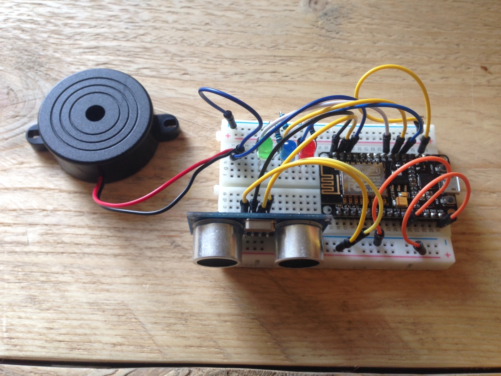

##Automatic waste meter:
In this manual I will explain how to build an automatic waste meter to measure the waste inside your bin. 

###Materials:
- Breadboard
- ESP8266 UMC
- Distance meter
- Buzzer
- 3 led's
- 3 resistors



###Setup
Connect the leds, distance sensor and buzzer to your ESP. I used the following setup. 

| Hardware        | Port           
| ------------- |:-------------:| 
| HC-SR04 Trig     | D0 | 
| HC-SR04 Echo     | D1 | 
| Buzzer     | D2 | 
| Led 1      | D6      |   
| Led 2 | D7      | 
| Led 3 | D8      |  

###Arduino
After connecting all the materials. We need to setup the arduino code. First of all you initialize all the wifi stuff and your materials. 

```
// INCLUDES
#include <ESP8266HTTPClient.h>
#include <ESP8266WiFi.h>
#include <ArduinoJson.h>

// WIFI
const char* ssid = "xxx";  
const char* pass = "xxx";
WiFiClient  client;

// HOST 
const char* host = "www.tijsluitse.com"; 
String path = "/iot/eindopdracht/waste.json";
const int httpPort = 80;

// LEDS
int led1 = D6;
int led2 = D7;
int led3 = D8;

// DISTANCE
int trigPin = D0;
int echoPin = D1;

// BUZZER
int buzzer = D2;
int sound = 250;

void setup() {

  // SETUP PINMODES
  pinMode(trigPin, OUTPUT);
  pinMode(echoPin, INPUT);
  pinMode(led1, OUTPUT);
  pinMode(led2, OUTPUT);
  pinMode(led3, OUTPUT);
  pinMode(buzzer, OUTPUT);

  Serial.begin(9600);

  // CONNECTING TO WIFI
  WiFi.begin(ssid, pass);
  Serial.print("Connecting to ");
  Serial.println(ssid);
  while (WiFi.status() != WL_CONNECTED) {
    delay(500);
    Serial.print(".");
  }
  
}
```

With the ESP8266 wifi drivers you are able to connect to the wifi. You need to replace these "xxx" with your own wifi network information. ```const char* ssid = "xxx"; const char* pass = "xxx";``` .

##Data file
To write data to the server you need to create a JSON file. ```[{time: "", waste: ""}]``` It will be an array with the time and the waste height. Later on the JSON file will be splitted in to arrays, which we can use to make a chart. Underneath you can check how we post data to the JSON file. 

###Buzzer file
To check if the buzzer is on or off you need to create an output.txt file. The php code writes "on" or "off" to the text file, which the ESP reads with a http request. Underneath you can check the http get request.  

##Arduino loop
After initializing all the materials in the Arduino code you need to create the loop which will run after uploading the code to the ESP. 

```
void loop() {

	  // DISTANCE 
	  int duration, distance;
	  digitalWrite(trigPin, LOW); 
	  delayMicroseconds(200); 
	  digitalWrite(trigPin, HIGH);
	  delayMicroseconds(1000);
	  digitalWrite(trigPin, LOW);
	  duration = pulseIn(echoPin, HIGH);
	  distance = (duration) / 58.2;
	  Serial.print ("distance ");
	  Serial.println (distance);
	  delay(500);

	  // WASTE
	  String waste;
	  
	  // GET REQUEST
	  HTTPClient http;
	  http.begin("http://www.tijsluitse.com/iot/eindopdracht/output.txt"); 
	  int httpCode = http.GET();        
	  String payload = http.getString();

	  Serial.println("Server: " + payload);

	    if (distance > 70 && distance < 1100) {  
	     	waste = "0";     
	     	digitalWrite(led1, LOW); 
	     	digitalWrite(led2, LOW);
	     	digitalWrite(led3, LOW); 
	     	Serial.println("Out of range");
	     	sound = 1;
	     	tone(buzzer, sound);
	    }
	    if (distance > 50 && distance < 70) {
	     	waste = "1";
	     	digitalWrite(led1, HIGH); 
	     	digitalWrite(led2, LOW);
	     	digitalWrite(led3, LOW);
	     	Serial.println("Empty");
	     	if (payload == "on") {
	      		sound = 50;
	      		tone(buzzer, sound);
	     	} else {
	      		noTone(buzzer);
	     	}
	    }  
	    if (distance > 20 && distance < 50) {
	     	waste = "2";
	     	digitalWrite(led1, LOW); 
	     	digitalWrite(led2, HIGH);
	     	digitalWrite(led3, LOW); 
	     	Serial.println("Almost full");
	     	if (payload == "on") {
	      		sound = 100;
	      		tone(buzzer, sound);
	     	} else {
	      		noTone(buzzer);
	     	}
	    }  
	    if (distance > 0 && distance < 20) {  
	     	waste = "4";     
	     	digitalWrite(led1, LOW); 
	     	digitalWrite(led2, LOW);
	     	digitalWrite(led3, HIGH); 
	     	Serial.println("Full");
	     	if (payload == "on") {
	      		sound = 250;
	      		tone(buzzer, sound);
	     	} else {
	      		noTone(buzzer);
	     	}
	    }

	 // POST DATA
	 String data;

	 data = "waste="+waste;
	 if (client.connect("www.tijsluitse.com", 80)) {
	   client.println("POST /iot/eindopdracht/index.php HTTP/1.1");
	   client.println("Host: www.tijsluitse.com");
	   client.println("Content-Type: application/x-www-form-urlencoded");
	   client.println("Connection: close");
	   client.print("Content-Length: ");
	   client.println(data.length());
	   client.println();
	   client.print(data);
	   client.println();
	   Serial.println(data);
	   Serial.println("Data send");
	 } else {
	   Serial.println("Something went wrong");
	 }
	     
	  // wait .5s to reloop this loop
	  delay(500);
}
```

What the Arduino code does is this. When the waste inside the bin is between two values, lets say between 0cm and 20cm what means that the bin is almost full, the value we post to the data file is waste = "4". The red LED is triggert and the GET request checks if the payload (in this case the payload is the text inside the output.txt file) is similair to "on", the buzzer gives a very hard tone. If the payload is similair to "off", there is no tone. You can have a look at the POST to see how the waste data is send to index.php. 

##POSTing data into JSON
The data is send to the index.php, from there it is posted to the JSON file with a timestamp. 

```
<?php 
    if ($_SERVER["REQUEST_METHOD"] === "POST") {  
        $data = $_POST["waste"];
        $timestamp = new DateTime();
        $time = $timestamp->format("Y-m-d H:i:s");
        $message = array("time" => $time, "waste" => $data);
        $inp = file_get_contents("waste.json");
        $tempArray = json_decode($inp);
        array_push($tempArray, $message);
        $jsonData = json_encode($tempArray);
        file_put_contents("waste.json", $jsonData);
    }
?>
```

The data which is posted into the JSON file now looks like this. Every piece of data is added to the array. 

```
[{"time":"0","waste":"0"},{"time":"2016-05-18 15:47:04","waste":"2"},{"time":"2016-05-18 15:47:05","waste":"2"}]
```

##History in Chart.js
To see the history of the bin data, it is nice to see it in a chart. Therefore I used Chart.js, a very easy to use Javascript library. The code to create this chart looks like this. But is you want a whole tutorial it is best to check out this [website](http://microbuilder.io/blog/2016/01/10/plotting-json-data-with-chart-js.html).

```
function drawLineChart() {

    var jsonData = $.ajax({
      	url: 'http://tijsluitse.com/iot/eindopdracht/waste.json',
      	dataType: 'json',
    }).done(function (results) {

	    var labels = [],
	        data = [];

	    results.forEach(function (result) {
	        labels.push(result.time);
	        data.push(parseInt(result.waste));
	    });
      
  		var tempData = {
        	labels : labels,
        	data: data
     	};

      	var dataChart = {
            labels: labels,
            datasets: [
                {
                    label: "LDR",
                    fillColor: "rgba(220,220,220,0.2)",
                    strokeColor: "rgba(220,220,220,1)",
                    pointColor: "rgba(220,220,220,1)",
                    pointStrokeColor: "#fff",
                    pointHighlightFill: "#fff",
                    pointHighlightStroke: "rgba(220,220,220,1)",
                    data: data
                }
            ]
        };

        var ctx = document.getElementById("linechart").getContext("2d");
        var myLineChart = new Chart(ctx).Line(dataChart);
    });
}

drawLineChart();
```

That's all you need to know to measure your own waste! You can check my own working version on my [website](http://www.tijsluitse.com/iot/eindopdracht).


